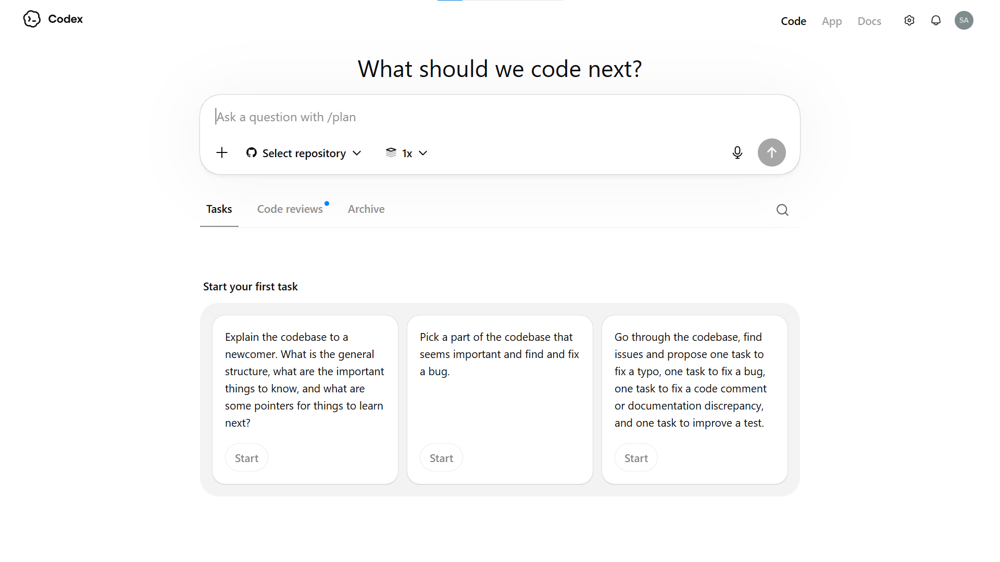

| Field | Value |
|---|---|
| **Website** | testdino |
| **Title/Topic** | Write Playwright Tests with Codex: Cloud Agent Guide (2026) |
| **Primary Keyword(s)** | write playwright tests with codex (210) |
| **Secondary Keyword(s)** | codex playwright testing (90), openai codex test generation (50), codex cloud agent playwright (40), playwright codex setup (30), codex agents.md playwright (20) |
| **Synonyms of Primary Keyword** | generate playwright tests using codex, create playwright tests with openai codex, codex AI playwright test automation |
| **Word Count** | 2800+ |
| **Target Audience** | QA engineers, SDETs, and developers who want to offload Playwright test writing to an AI cloud agent instead of writing every test manually |
| **Internal Linking Plan** | Playwright AI codegen, Playwright MCP vs CLI, Playwright test agents, flaky tests guide, Playwright best practices, AI write playwright tests, Playwright e2e testing, Playwright assertions, Playwright parallel execution, Playwright observability |
| **Meta Title (60)** | Write Playwright Tests with Codex: Cloud Agent Guide (2026) |
| **Meta Description (140)** | Write Playwright tests with OpenAI Codex cloud agent. Setup, task prompts, async test generation workflow, and TestDino reporting integration. |
| **Excerpt (200)** | Learn how to write Playwright tests with OpenAI Codex, the cloud-based coding agent. This guide covers environment setup, AGENTS.md configuration, effective task prompts, async test generation workflow, and connecting TestDino for real-time test reporting and failure analysis. |

## Table of contents

- [What is OpenAI Codex and why does it matter for testing?](#what-is-openai-codex-and-why-does-it-matter-for-testing)
- [How the Codex cloud agent works (the async workflow)](#how-the-codex-cloud-agent-works-the-async-workflow)
- [Setting up your repository for Codex](#setting-up-your-repository-for-codex)
- [How to write Playwright tests with Codex (step by step)](#how-to-write-playwright-tests-with-codex-step-by-step)
- [Codex vs Cursor for Playwright test generation](#codex-vs-cursor-for-playwright-test-generation)
- [Running and reporting tests with TestDino](#running-and-reporting-tests-with-testdino)
- [Fixing flaky and failing tests with Codex](#fixing-flaky-and-failing-tests-with-codex)
- [FAQs](#faqs)

# Write Playwright Tests with Codex: Cloud Agent Guide (2026)

AI coding agents have shifted from autocomplete inside editors to cloud-based workers that handle entire tasks in the background. Teams are now delegating test writing to these agents so engineers can stay focused on feature work instead of switching context every time a new flow needs coverage.

The challenge is that most AI test generation still happens inside an IDE, which means someone needs to sit with the tool, prompt it, review output, and re-prompt until the test looks right. That back-and-forth burns time and defeats the purpose of automation.

This guide shows you how to write Playwright tests with Codex, OpenAI's cloud coding agent, so you can assign a testing task from a browser tab and come back to a ready pull request with tests that actually run.

## What is OpenAI Codex and why does it matter for testing?

<div style="border-left:4px solid #3B82F6;background:#EFF6FF;padding:12px 14px;border-radius:8px;margin:14px 0;"><strong>Definition</strong><br/>OpenAI Codex is a cloud-based software engineering agent that reads your repository, runs tasks in an isolated sandbox, and delivers results as code changes or pull requests. It is powered by the codex-1 model, a variant of OpenAI's o3 reasoning model optimized for code.</div>

Unlike IDE-based assistants (Copilot, Cursor, Cline), Codex does not live inside your editor. You access it through ChatGPT at [codex](https://chatgpt.com/codex), connect a GitHub repo, and give it tasks in plain English. Each task gets its own sandboxed environment with your full codebase loaded.

Here is what makes it relevant for Playwright testing:

- **Async execution.** You assign a task, close the tab, and come back later. No sitting and watching.
- **Full repo context.** Codex clones your entire repo, so it reads your page objects, configs, and existing specs before writing new ones.
- **Sandboxed runs.** Each task spins up a container where Codex can install dependencies and run `npx playwright test` to verify the generated code.
- **PR output.** When done, it opens a pull request on your repo with the new or fixed test files.

This means you can batch multiple test-writing tasks, fire them off in parallel, and review the PRs when you're ready.

<div style="border-left:4px solid #22C55E;background:#ECFDF5;padding:12px 14px;border-radius:8px;margin:14px 0;"><strong>Note</strong><br/>Codex is available on ChatGPT Plus, Pro, and Team plans. Enterprise and Edu plans also have access. The codex-1 model is specifically tuned for agentic coding tasks and differs from the GPT-4o model used in regular ChatGPT conversations.</div>

<!-- Infographic 1: How Codex Works -->
<div style="font-family: 'Geist', 'Inter', system-ui, sans-serif; background: #0A0A0A; border-radius: 16px; padding: 40px 32px; max-width: 720px; margin: 28px auto; color: #FAFAFA;">
  <h3 style="font-size: 20px; font-weight: 700; margin: 0 0 28px 0; color: #FAFAFA; letter-spacing: -0.3px;">How Codex handles a Playwright test task</h3>
  <div style="display: flex; flex-direction: column; gap: 0;">
    <div style="display: flex; align-items: flex-start; gap: 16px;">
      <div style="min-width: 40px; height: 40px; background: #2563EB; border-radius: 10px; display: flex; align-items: center; justify-content: center; font-weight: 700; font-size: 16px; color: #fff;">1</div>
      <div style="padding: 8px 0;">
        <p style="margin: 0; font-weight: 600; font-size: 15px; color: #FAFAFA;">You submit a task prompt</p>
        <p style="margin: 4px 0 0 0; font-size: 13px; color: #A1A1AA; font-family: 'Geist Mono', monospace;">"Write an e2e test for the checkout flow"</p>
      </div>
    </div>
    <div style="margin-left: 19px; width: 2px; height: 20px; background: #27272A;"></div>
    <div style="display: flex; align-items: flex-start; gap: 16px;">
      <div style="min-width: 40px; height: 40px; background: #2563EB; border-radius: 10px; display: flex; align-items: center; justify-content: center; font-weight: 700; font-size: 16px; color: #fff;">2</div>
      <div style="padding: 8px 0;">
        <p style="margin: 0; font-weight: 600; font-size: 15px; color: #FAFAFA;">Codex spins up a sandbox</p>
        <p style="margin: 4px 0 0 0; font-size: 13px; color: #A1A1AA;">Clones your repo, installs deps, reads AGENTS.md</p>
      </div>
    </div>
    <div style="margin-left: 19px; width: 2px; height: 20px; background: #27272A;"></div>
    <div style="display: flex; align-items: flex-start; gap: 16px;">
      <div style="min-width: 40px; height: 40px; background: #2563EB; border-radius: 10px; display: flex; align-items: center; justify-content: center; font-weight: 700; font-size: 16px; color: #fff;">3</div>
      <div style="padding: 8px 0;">
        <p style="margin: 0; font-weight: 600; font-size: 15px; color: #FAFAFA;">Reads existing code for context</p>
        <p style="margin: 4px 0 0 0; font-size: 13px; color: #A1A1AA;">Page objects, test helpers, playwright.config.ts</p>
      </div>
    </div>
    <div style="margin-left: 19px; width: 2px; height: 20px; background: #27272A;"></div>
    <div style="display: flex; align-items: flex-start; gap: 16px;">
      <div style="min-width: 40px; height: 40px; background: #2563EB; border-radius: 10px; display: flex; align-items: center; justify-content: center; font-weight: 700; font-size: 16px; color: #fff;">4</div>
      <div style="padding: 8px 0;">
        <p style="margin: 0; font-weight: 600; font-size: 15px; color: #FAFAFA;">Writes tests and runs them</p>
        <p style="margin: 4px 0 0 0; font-size: 13px; color: #A1A1AA; font-family: 'Geist Mono', monospace;">npx playwright test checkout.spec.ts</p>
      </div>
    </div>
    <div style="margin-left: 19px; width: 2px; height: 20px; background: #27272A;"></div>
    <div style="display: flex; align-items: flex-start; gap: 16px;">
      <div style="min-width: 40px; height: 40px; background: #16A34A; border-radius: 10px; display: flex; align-items: center; justify-content: center; font-weight: 700; font-size: 16px; color: #fff;">5</div>
      <div style="padding: 8px 0;">
        <p style="margin: 0; font-weight: 600; font-size: 15px; color: #FAFAFA;">Opens a pull request</p>
        <p style="margin: 4px 0 0 0; font-size: 13px; color: #A1A1AA;">You review the diff, merge or request changes</p>
      </div>
    </div>
  </div>
</div>

## How the Codex cloud agent works (the async workflow)

The biggest mental shift with Codex is that it is not a copilot. It is a coworker. You hand it a task, and it works on its own.

Here is the flow:

1. **Connect your repo.** Go to `chatgpt.com/codex` and link your GitHub account. Select the repository and the branch you want Codex to work on.
2. **Write a task prompt.** Describe what you need in plain English. Be specific about file paths, test patterns, and the behavior you expect.
3. **Codex boots a container.** It clones the repo at the selected branch, runs any setup scripts, and installs dependencies like `@playwright/test`.
4. **Codex writes code.** It reads your existing codebase for patterns and generates the new files. It can also modify existing files.
5. **Codex verifies.** It runs the tests inside the sandbox. If tests fail, it reads the error output and tries to fix them autonomously.
6. **Output.** You get a PR with the code changes, plus a terminal log showing every command it ran and every file it touched.

<div style="border-left:4px solid #F59E0B;background:#FFFBEB;padding:12px 14px;border-radius:8px;margin:14px 0;"><strong>Tip</strong><br/>You can fire off multiple Codex tasks at the same time. Each one runs in its own sandbox. Use this to parallelize test generation across different features or flows.</div>

The sandbox environment is network-disabled by default after setup. This means Codex cannot make outbound API calls during task execution. It works entirely with what is already in the repo and the packages installed during setup.

This is a key difference from IDE-based agents. Tools like [Playwright MCP](https://testdino.com/blog/playwright-cli-vs-mcp/) let agents interact with a live browser. Codex cannot do this. It relies on your existing test infrastructure and Playwright's headless mode to run tests.



## Setting up your repository for Codex

Before you send tasks to Codex, prepare your repository so it can work effectively.

### Install Playwright in the project

If you do not already have Playwright configured, set it up first:

```bash
# terminal
npm init playwright@latest
```

This creates `playwright.config.ts`, a `tests/` folder, and installs the necessary browsers. Codex will use your existing config, so make sure it reflects your actual project needs. If you need background on structuring your test setup, the [Playwright e2e testing](https://testdino.com/blog/playwright-e2e-testing/) guide covers the full configuration.

### Create an AGENTS.md file

This is the most important step. Codex reads `AGENTS.md` in the root of your repository to understand project conventions.

```markdown
<!-- AGENTS.md -->
# Testing Guidelines

## Framework
- We use Playwright with TypeScript for all e2e tests.
- Tests live in the `tests/` directory.
- Page objects are in `tests/pages/`.

## Conventions
- Use `test.describe` blocks to group related tests.
- Use role-based locators (`getByRole`, `getByLabel`, `getByTestId`) over CSS selectors.
- Every test must have a meaningful name describing the user action and expected result.
- Use `test.beforeEach` for common navigation and setup.

## Running tests
- Run all tests: `npx playwright test`
- Run specific file: `npx playwright test tests/checkout.spec.ts`
- Run in headed mode: `npx playwright test --headed`

## Dependencies
- Run `npm ci` to install all dependencies.
- Run `npx playwright install --with-deps` to install browser binaries.
```

<div style="border-left:4px solid #3B82F6;background:#EFF6FF;padding:12px 14px;border-radius:8px;margin:14px 0;"><strong>Definition</strong><br/>AGENTS.md is a markdown file placed in the root of your repository that gives instructions to AI coding agents. Codex reads this file before starting any task. Think of it as a README specifically for the AI, telling it your project's rules, folder structure, and preferred patterns.</div>

You can also place `AGENTS.md` files in subdirectories. Codex reads the most specific one relative to the files it is editing. This is useful for monorepos where frontend tests and API tests follow different conventions.

### Set up a setup script (optional)

Codex allows you to configure a setup command that runs every time it boots a new sandbox. Navigate to the Codex settings in ChatGPT and define it:

```bash
# terminal - setup script for Codex sandbox
npm ci && npx playwright install --with-deps chromium
```

This ensures every task starts with dependencies installed and at least the Chromium browser available for headless tests.

<<< cta
heading: Track every test run in one place
sub-heading: Real-time dashboards, failure trends, and flaky test detection.
button: Start free(https://app.testdino.com/?utm_source=testdino&utm_medium=blog&utm_campaign=test-with-codex) >>>

## How to write Playwright tests with Codex (step by step)

Now that your repo is ready, here is how to actually generate tests.

### Step 1: write a clear task prompt

The quality of the generated test depends entirely on how well you describe the task. Be specific.

**Weak prompt:**
> Write tests for the login page.

**Strong prompt:**
> Write a Playwright test file at `tests/auth/login.spec.ts` that covers:
> 1. Successful login with valid email and password. Assert redirect to /dashboard.
> 2. Login with invalid password. Assert the error message "Invalid credentials" appears.
> 3. Login with empty fields. Assert both field validation messages appear.
> Use the existing `LoginPage` page object from `tests/pages/login.page.ts`. Follow the patterns in `tests/auth/signup.spec.ts` for reference.

The difference is context. When you tell Codex which files to reference, which page objects to use, and what assertions to make, it produces code that fits your project.

<div style="border-left:4px solid #F59E0B;background:#FFFBEB;padding:12px 14px;border-radius:8px;margin:14px 0;"><strong>Tip</strong><br/>Reference existing spec files in your prompt. Codex will read those files and mirror the patterns, including import styles, describe block structure, and assertion methods. This is the fastest way to get consistent output.</div>

### Step 2: select the right branch and model

In the Codex dashboard, select the branch you want changes committed to. Codex creates a new branch off of your selected base branch and opens a PR against it.

The model is `codex-1` by default. It is optimized for agentic tasks where the model needs to plan multiple steps, edit files, and run commands. This is different from GPT-4o which handles conversations well but is not tuned for long-running code tasks.

### Step 3: submit and wait

Click **Start coding**. Codex will:

- Clone your repo
- Run the setup script
- Read `AGENTS.md` and any files referenced in your prompt
- Generate the test file(s)
- Run `npx playwright test` to verify

You will see a progress indicator. For a typical single-file test task, expect 2 to 8 minutes depending on complexity.

### Step 4: review the output

Once done, Codex shows you:

- **The full terminal log** with every command it ran
- **A diff view** of all file changes
- **Test results** showing pass/fail status

If the tests passed in the sandbox, you can create the PR directly. If something failed, you can give follow-up instructions in the same task thread.

Here is an example of what a Codex-generated test looks like:

```typescript
// tests/auth/login.spec.ts
import { test, expect } from '@playwright/test';
import { LoginPage } from '../pages/login.page';

test.describe('Login flow', () => {
  let loginPage: LoginPage;

  test.beforeEach(async ({ page }) => {
    loginPage = new LoginPage(page);
    await loginPage.navigate();
  });

  test('should login with valid credentials and redirect to dashboard', async ({ page }) => {
    await loginPage.login('user@example.com', 'ValidPass123');
    await expect(page).toHaveURL(/.*dashboard/);
  });

  test('should show error for invalid password', async ({ page }) => {
    await loginPage.login('user@example.com', 'WrongPass');
    await expect(loginPage.errorMessage).toHaveText('Invalid credentials');
  });

  test('should show validation when fields are empty', async ({ page }) => {
    await loginPage.submitEmpty();
    await expect(loginPage.emailError).toBeVisible();
    await expect(loginPage.passwordError).toBeVisible();
  });
});
```

Notice how it used [Playwright assertions](https://testdino.com/blog/playwright-assertions/) like `toHaveURL` and `toHaveText`, followed the `test.describe` grouping pattern, and used the page object from the prompt. This is the result of proper context in both the prompt and the `AGENTS.md`.

**[Screenshot suggestion 2]:** Capture the Codex task completion screen showing the terminal log and the diff view side by side. Submit a sample task, wait for completion, and screenshot the full output panel. Place this after the code example above.

## Codex vs Cursor for Playwright test generation

Both tools can generate Playwright tests, but they work in fundamentally different ways. If you have used [Playwright AI codegen](https://testdino.com/blog/playwright-ai-codegen/) tools before, this comparison will help you understand where each fits.

<table style="width:100%;border-collapse:collapse;font-family:system-ui,sans-serif;font-size:14px;">
<thead>
<tr style="background:#0A0A0A;color:#FAFAFA;">
<th style="padding:12px 16px;text-align:left;border:1px solid #27272A;">Feature</th>
<th style="padding:12px 16px;text-align:left;border:1px solid #27272A;">OpenAI Codex</th>
<th style="padding:12px 16px;text-align:left;border:1px solid #27272A;">Cursor</th>
</tr>
</thead>
<tbody>
<tr>
<td style="padding:10px 16px;border:1px solid #E5E7EB;font-weight:600;">Execution model</td>
<td style="padding:10px 16px;border:1px solid #E5E7EB;">Cloud sandbox (async)</td>
<td style="padding:10px 16px;border:1px solid #E5E7EB;">Local IDE (real-time)</td>
</tr>
<tr style="background:#F9FAFB;">
<td style="padding:10px 16px;border:1px solid #E5E7EB;font-weight:600;">User interaction</td>
<td style="padding:10px 16px;border:1px solid #E5E7EB;">Fire and forget</td>
<td style="padding:10px 16px;border:1px solid #E5E7EB;">Interactive editing</td>
</tr>
<tr>
<td style="padding:10px 16px;border:1px solid #E5E7EB;font-weight:600;">Browser access</td>
<td style="padding:10px 16px;border:1px solid #E5E7EB;">Headless in sandbox only</td>
<td style="padding:10px 16px;border:1px solid #E5E7EB;">Full via Playwright MCP</td>
</tr>
<tr style="background:#F9FAFB;">
<td style="padding:10px 16px;border:1px solid #E5E7EB;font-weight:600;">Context source</td>
<td style="padding:10px 16px;border:1px solid #E5E7EB;">Full repo clone + AGENTS.md</td>
<td style="padding:10px 16px;border:1px solid #E5E7EB;">Open files + .cursorrules + MCP</td>
</tr>
<tr>
<td style="padding:10px 16px;border:1px solid #E5E7EB;font-weight:600;">Parallel tasks</td>
<td style="padding:10px 16px;border:1px solid #E5E7EB;">Yes (multiple sandboxes)</td>
<td style="padding:10px 16px;border:1px solid #E5E7EB;">One at a time</td>
</tr>
<tr style="background:#F9FAFB;">
<td style="padding:10px 16px;border:1px solid #E5E7EB;font-weight:600;">Output</td>
<td style="padding:10px 16px;border:1px solid #E5E7EB;">Pull request on GitHub</td>
<td style="padding:10px 16px;border:1px solid #E5E7EB;">Direct file edits</td>
</tr>
<tr>
<td style="padding:10px 16px;border:1px solid #E5E7EB;font-weight:600;">Test verification</td>
<td style="padding:10px 16px;border:1px solid #E5E7EB;">Runs tests in sandbox</td>
<td style="padding:10px 16px;border:1px solid #E5E7EB;">Runs tests locally via terminal</td>
</tr>
<tr style="background:#F9FAFB;">
<td style="padding:10px 16px;border:1px solid #E5E7EB;font-weight:600;">Network during tasks</td>
<td style="padding:10px 16px;border:1px solid #E5E7EB;">Disabled after setup</td>
<td style="padding:10px 16px;border:1px solid #E5E7EB;">Full network access</td>
</tr>
</tbody>
</table>

### When Codex is the better fit

- You have a backlog of test specs to write and want to batch them.
- You prefer a PR-based workflow where tests go through code review.
- Your team has strong conventions in `AGENTS.md` that the AI should follow.
- You want parallel execution across multiple features at once.

### When Cursor is the better fit

- You need the AI to interact with a live browser to explore the UI. [Playwright test agents](https://testdino.com/blog/playwright-test-agents/) like the Planner and Generator work well through Cursor's MCP integration.
- You want real-time back-and-forth while writing a complex test.
- You are debugging a specific test failure and need the agent to see the page.

For teams that already [write and automate Playwright tests with AI](https://testdino.com/blog/ai-write-playwright-tests/), Codex adds a layer on top. You use Cursor for interactive work and Codex for batch generation.

<!-- Infographic 2: Codex vs Cursor at a glance -->
<div style="font-family: 'Geist', 'Inter', system-ui, sans-serif; background: #0A0A0A; border-radius: 16px; padding: 40px 32px; max-width: 720px; margin: 28px auto; color: #FAFAFA;">
  <h3 style="font-size: 20px; font-weight: 700; margin: 0 0 28px 0; color: #FAFAFA; letter-spacing: -0.3px;">Codex vs Cursor: pick the right workflow</h3>
  <div style="display: grid; grid-template-columns: 1fr 1fr; gap: 20px;">
    <div style="background: #18181B; border-radius: 12px; padding: 24px; border: 1px solid #27272A;">
      <div style="display: flex; align-items: center; gap: 10px; margin-bottom: 16px;">
        <svg width="20" height="20" fill="none" stroke="#2563EB" stroke-width="2" viewBox="0 0 24 24"><path d="M12 2L2 7l10 5 10-5-10-5zM2 17l10 5 10-5M2 12l10 5 10-5"/></svg>
        <span style="font-weight: 700; font-size: 16px; color: #FAFAFA;">Codex</span>
      </div>
      <ul style="margin: 0; padding-left: 18px; font-size: 13px; color: #A1A1AA; line-height: 1.8;">
        <li style="color: #D4D4D8;">Batch test generation</li>
        <li style="color: #D4D4D8;">PR-based review flow</li>
        <li style="color: #D4D4D8;">Parallel sandbox tasks</li>
        <li style="color: #D4D4D8;">No IDE required</li>
        <li style="color: #D4D4D8;">AGENTS.md-driven context</li>
      </ul>
    </div>
    <div style="background: #18181B; border-radius: 12px; padding: 24px; border: 1px solid #27272A;">
      <div style="display: flex; align-items: center; gap: 10px; margin-bottom: 16px;">
        <svg width="20" height="20" fill="none" stroke="#A855F7" stroke-width="2" viewBox="0 0 24 24"><rect x="2" y="3" width="20" height="14" rx="2"/><line x1="8" y1="21" x2="16" y2="21"/><line x1="12" y1="17" x2="12" y2="21"/></svg>
        <span style="font-weight: 700; font-size: 16px; color: #FAFAFA;">Cursor</span>
      </div>
      <ul style="margin: 0; padding-left: 18px; font-size: 13px; color: #A1A1AA; line-height: 1.8;">
        <li style="color: #D4D4D8;">Interactive test writing</li>
        <li style="color: #D4D4D8;">Live browser via MCP</li>
        <li style="color: #D4D4D8;">Real-time debugging</li>
        <li style="color: #D4D4D8;">In-editor file edits</li>
        <li style="color: #D4D4D8;">.cursorrules context</li>
      </ul>
    </div>
  </div>
</div>

[Graph: AI-Assisted Test Generation Time Savings, X-axis: Task Type (Single test file, Multi-file suite, Full feature coverage, Bug-fix regression test), Y-axis: Average Time in Minutes, Data Source: TestGuild 2025 AI Testing Survey - key findings: manual test writing averaged 45 min per test file vs 8 min with AI-assisted generation for single files; multi-file suites dropped from 180 min to 35 min; full feature coverage from 480 min to 90 min; bug-fix regression from 30 min to 6 min, Graph Type: Grouped bar chart comparing Manual vs AI-Assisted for each task type]

## Running and reporting tests with TestDino

Codex can run tests inside its sandbox, but those results disappear once the task is done. For persistent tracking, failure analysis, and trend data across test runs, you need a reporting layer.

TestDino integrates directly with Playwright to capture test results from every run, whether it happens in Codex's sandbox, your local machine, or CI.

### Connect TestDino to your Playwright project

Install the TestDino reporter:

```bash
# terminal
npm install @testdino/playwright-reporter --save-dev
```

Add it to your `playwright.config.ts`:

```typescript
// playwright.config.ts
import { defineConfig } from '@playwright/test';

export default defineConfig({
  reporter: [
    ['list'],
    ['@testdino/playwright-reporter', {
      projectId: 'YOUR_PROJECT_ID',
      token: process.env.TESTDINO_TOKEN,
    }],
  ],
  // ...rest of your config
});
```

### Run tests with reporting

Once configured, every `npx playwright test` run uploads results to TestDino automatically. You can also use the TestDino CLI for more control:

```bash
# terminal
npx tdpw test
```

This command runs your Playwright suite and sends results to the TestDino dashboard where you get:

- **Real-time dashboards** showing pass/fail rates per test, per file, per suite
- **Failure trends** that surface which tests fail most often
- **Flaky test detection** that flags tests with inconsistent results across runs
- **Execution timelines** showing how long each test takes over time

For teams running [Playwright parallel execution](https://testdino.com/blog/playwright-parallel-execution/), TestDino aggregates results from all workers into a single view. It is the missing [Playwright observability platform](https://testdino.com/blog/playwright-observability-platform/) that connects your CI runs with actionable data.

<<< cta
heading: See why tests fail before users do
sub-heading: Get failure analysis, flaky test alerts, and run history in one view.
button: Try free(https://app.testdino.com/?utm_source=testdino&utm_medium=blog&utm_campaign=test-with-codex) >>>

### Update AGENTS.md for TestDino integration

Add the reporting setup to your `AGENTS.md` so Codex knows about it:

```markdown
<!-- AGENTS.md (updated section) -->
## Test reporting
- We use TestDino for test result reporting.
- Reporter is configured in playwright.config.ts.
- Environment variable TESTDINO_TOKEN must be set before running tests.
- Use `npx tdpw test` to run tests with reporting enabled.
```

When Codex generates new tests and runs them in the sandbox, the reporter will attempt to upload results. If the sandbox has network disabled, the tests still run and pass/fail locally. The real reporting happens when the PR is merged and tests run in CI with the token set.

**[Screenshot suggestion 3]:** Capture the TestDino dashboard showing a Playwright test run with pass/fail breakdown, failure trend chart, and flaky test indicators. Open your TestDino dashboard at app.testdino.com, navigate to a project with Playwright test history, and screenshot the overview page. Place this below the AGENTS.md update section.

<!-- Infographic 3: TestDino Reporting Pipeline -->
<div style="font-family: 'Geist', 'Inter', system-ui, sans-serif; background: #0A0A0A; border-radius: 16px; padding: 40px 32px; max-width: 720px; margin: 28px auto; color: #FAFAFA;">
  <h3 style="font-size: 20px; font-weight: 700; margin: 0 0 28px 0; color: #FAFAFA; letter-spacing: -0.3px;">From Codex PR to TestDino dashboard</h3>
  <div style="display: flex; align-items: center; justify-content: space-between; flex-wrap: wrap; gap: 8px;">
    <div style="background: #18181B; border-radius: 10px; padding: 16px 14px; border: 1px solid #27272A; text-align: center; flex: 1; min-width: 120px;">
      <svg width="22" height="22" fill="none" stroke="#2563EB" stroke-width="2" viewBox="0 0 24 24" style="margin-bottom:8px;"><path d="M14 2H6a2 2 0 0 0-2 2v16a2 2 0 0 0 2 2h12a2 2 0 0 0 2-2V8z"/><polyline points="14 2 14 8 20 8"/></svg>
      <p style="margin: 0; font-size: 12px; font-weight: 600; color: #FAFAFA;">Codex generates tests</p>
    </div>
    <svg width="24" height="24" fill="none" stroke="#3F3F46" stroke-width="2" viewBox="0 0 24 24"><path d="M5 12h14M12 5l7 7-7 7"/></svg>
    <div style="background: #18181B; border-radius: 10px; padding: 16px 14px; border: 1px solid #27272A; text-align: center; flex: 1; min-width: 120px;">
      <svg width="22" height="22" fill="none" stroke="#F59E0B" stroke-width="2" viewBox="0 0 24 24"><path d="M9 19c-5 1.5-5-2.5-7-3m14 6v-3.87a3.37 3.37 0 0 0-.94-2.61c3.14-.35 6.44-1.54 6.44-7A5.44 5.44 0 0 0 20 4.77 5.07 5.07 0 0 0 19.91 1S18.73.65 16 2.48a13.38 13.38 0 0 0-7 0C6.27.65 5.09 1 5.09 1A5.07 5.07 0 0 0 5 4.77a5.44 5.44 0 0 0-1.5 3.78c0 5.42 3.3 6.61 6.44 7A3.37 3.37 0 0 0 9 18.13V22"/></svg>
      <p style="margin: 0; font-size: 12px; font-weight: 600; color: #FAFAFA;">PR merged to main</p>
    </div>
    <svg width="24" height="24" fill="none" stroke="#3F3F46" stroke-width="2" viewBox="0 0 24 24"><path d="M5 12h14M12 5l7 7-7 7"/></svg>
    <div style="background: #18181B; border-radius: 10px; padding: 16px 14px; border: 1px solid #27272A; text-align: center; flex: 1; min-width: 120px;">
      <svg width="22" height="22" fill="none" stroke="#22C55E" stroke-width="2" viewBox="0 0 24 24"><circle cx="12" cy="12" r="10"/><polyline points="12 6 12 12 16 14"/></svg>
      <p style="margin: 0; font-size: 12px; font-weight: 600; color: #FAFAFA;">CI runs tests</p>
    </div>
    <svg width="24" height="24" fill="none" stroke="#3F3F46" stroke-width="2" viewBox="0 0 24 24"><path d="M5 12h14M12 5l7 7-7 7"/></svg>
    <div style="background: #18181B; border-radius: 10px; padding: 16px 14px; border: 1px solid #27272A; text-align: center; flex: 1; min-width: 120px;">
      <svg width="22" height="22" fill="none" stroke="#A855F7" stroke-width="2" viewBox="0 0 24 24"><rect x="3" y="3" width="18" height="18" rx="2"/><path d="M3 9h18M9 21V9"/></svg>
      <p style="margin: 0; font-size: 12px; font-weight: 600; color: #FAFAFA;">TestDino dashboard</p>
    </div>
  </div>
</div>

## Fixing flaky and failing tests with Codex

Once your tests are running and reporting into TestDino, you will inevitably find tests that fail intermittently. These [flaky tests](https://testdino.com/blog/flaky-tests-complete-guide/) are the most time-consuming part of test maintenance.

Codex can help fix them. Here is the workflow:

### Identify the flaky test

Open TestDino and check the flaky test panel. It shows:

- Which tests flap between pass and fail across runs
- The failure frequency (e.g., fails 3 out of 10 runs)
- The error message and stack trace from each failure

### Write a fix task for Codex

Use the information from TestDino to write a specific Codex task:

```
Fix the flaky test in tests/checkout/payment.spec.ts:
- Test name: "should complete payment and show confirmation"
- It fails intermittently with: "Timeout waiting for element: [data-testid='confirmation-message']"
- The likely issue is a race condition where the payment API response is slow.
- Add a `waitFor` or increase the timeout for the confirmation element.
- Reference tests/checkout/cart.spec.ts for our wait pattern.
- Run the test 3 times to verify stability.
```

<div style="border-left:4px solid #F59E0B;background:#FFFBEB;padding:12px 14px;border-radius:8px;margin:14px 0;"><strong>Tip</strong><br/>When asking Codex to fix a flaky test, always include the exact error message and the failure pattern. Generic prompts like "fix the flaky test" produce generic fixes. Specific error details lead to targeted solutions.</div>

### Let Codex iterate

Codex will:

1. Read the failing test file
2. Analyze the error pattern
3. Apply a fix (better waits, more resilient locators, retry logic)
4. Run the test multiple times in the sandbox
5. Open a PR with the fix

This is where following [Playwright best practices](https://testdino.com/blog/playwright-best-practices/) in your codebase pays off. When Codex sees consistent patterns across your test files, its fixes align with your team's style.

For reducing ongoing maintenance, the [test maintenance in Playwright](https://testdino.com/blog/reduce-test-maintenance/) guide covers patterns that make tests more resilient from the start, reducing the number of fixes Codex needs to make later.

### Improve test reliability over time

By combining TestDino's [flaky test benchmark](https://testdino.com/blog/flaky-test-benchmark/) data with Codex's fix capabilities, you create a feedback loop:

1. TestDino flags the flaky test
2. You send the fix task to Codex
3. Codex fixes and verifies
4. The fix goes through PR review
5. TestDino confirms the test is stable after merge

This beats manually debugging flaky tests one by one, which is the workflow most teams are stuck in.

<<< cta
heading: Catch flaky tests before they pile up
sub-heading: TestDino detects patterns across runs, not just one-off failures.
button: [Get started](https://app.testdino.com/?utm_source=testdino&utm_medium=blog&utm_campaign=test-with-codex) >>>

## Conclusion

Writing Playwright tests with Codex changes the dynamic from "sit with the AI and iterate" to "assign the task and review the PR." The async, cloud-based model allows you to generate tests at scale without blocking your local environment or your workday.

The key to making it work well comes down to three things:

- **AGENTS.md.** Give Codex clear project rules so it generates tests that match your conventions.
- **Specific prompts.** Reference existing spec files, page objects, and expected assertions. Vague prompts produce vague tests.
- **A reporting layer.** Codex can verify tests in its sandbox, but TestDino gives you the long-term visibility needed to track what passes, what fails, and what flakes.

For teams already using AI-assisted testing through [AI test generation tools](https://testdino.com/blog/ai-test-generation-tools/), Codex adds a powerful batch processing layer. Pair it with TestDino for end-to-end visibility, from the moment a test is generated to every run it completes in production CI.

## FAQs

### Can Codex interact with a live browser like Cursor can?

No. Codex runs tasks in a sandboxed cloud container where network access is disabled after the initial setup. It can run Playwright tests in headless mode inside the sandbox, but it cannot open a visible browser or interact with a live website. If you need an AI agent to explore a running application and generate tests from live interactions, use an IDE tool with [Playwright MCP](https://testdino.com/blog/playwright-cli-vs-mcp/) support instead.

### Is AGENTS.md required to use Codex for test generation?

Not technically. Codex will still work without it by reading your codebase for patterns. But without explicit rules, it may produce tests that do not follow your project's conventions. An `AGENTS.md` file dramatically improves output quality. It takes 5 minutes to set up and saves hours of rework. Think of it as the Codex equivalent of `.cursorrules`.

### How does Codex handle tests that need a running backend server?

Codex's sandbox is network-disabled, so it cannot reach external APIs or databases. If your end-to-end tests require a running backend, you have two options. First, include a local dev server setup in your project (like `npm run dev`) that Codex can start in the sandbox. Second, write tests against mocked APIs using Playwright's `route` method for network interception. The second approach is more reliable for AI-generated tests since it removes the dependency on external services.

### Can I use Codex and Cursor together for Playwright testing?

Yes, and this is a recommended approach for many teams. Use Cursor for interactive work (debugging failures, exploring UI flows with MCP, writing complex custom assertions) and Codex for batch work (generating entire test suites for new features, writing regression tests from specs, fixing known flaky tests in bulk). Each tool has strengths that complement the other.